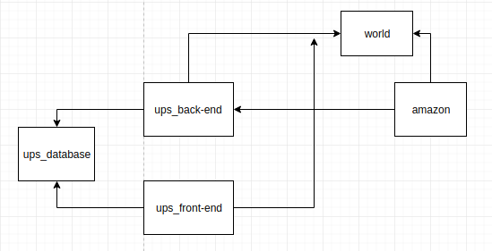
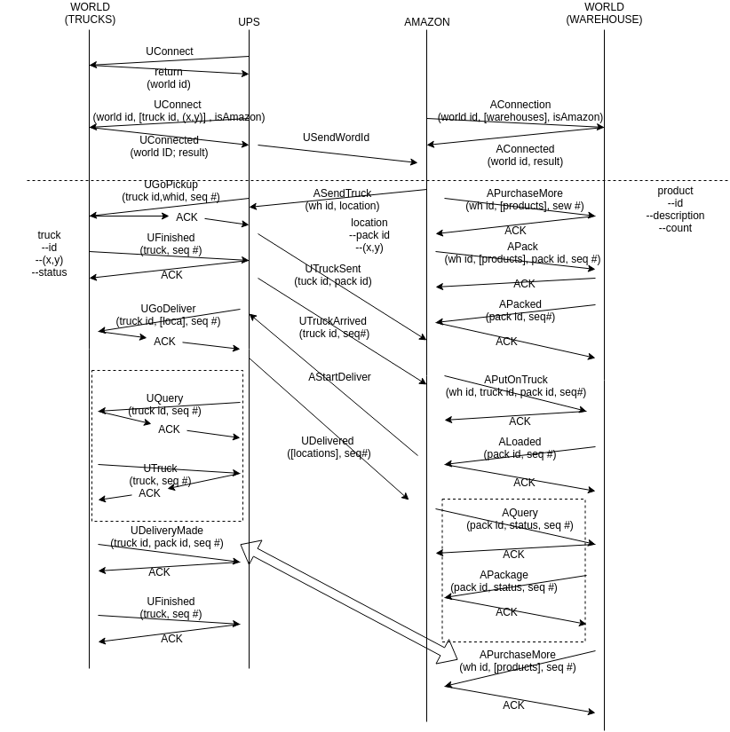

### _DESCRIPTION_

In this project, a mini-UPS system will be implemented, and collaborates with an a mini-Amazon online shopping system. The UPS system is composed of a front-end and back-end system; the former has features of searching package by providing track number  for an anonymous user and navigating all packages for a registered user; and the latter will communicate with the Amazon back-end server and the "world" who is manipulating the trucks owned by UPS and the warehouse owned by Amazon. Once the package is delivered, UPS back-end server will send an email to its UPS user. Since the system will be test before being employed in the real world, a virtual world server is introduced in this project during development. Both Amazon and UPS are required to declare number and status of their trucks and warehouses, respectively.

### _PROTOCOL_ 

All data format used to communicate between servers are generated via Google's Protocol Buffer or Protobuf. The summary of commands and responses.

```protobuf
//UPS-to-World protocols
message UCommands{
  repeated UGoPickup pickups = 1;
  repeated UGoDeliver deliveries = 2;
  optional uint32 simspeed = 3;
  optional bool disconnect = 4;
  repeated UQuery queries = 5;
  repeated int64 acks = 6;
}

message UResponses{
  repeated UFinished completions = 1;
  repeated UDeliveryMade delivered = 2;
  optional bool finished = 3;
  repeated int64 acks = 4;
  repeated UTruck truckstatus = 5;
  repeated UErr error = 6;
}
//UPS-to-Amazon protocols
message AtoUCommands{
    repeated ASendTruck sendtrucks = 1;
    repeated AStartDelivery startdelivery = 2;
}

message UtoAResponses{
    repeated UTruckSent trucksent = 1;
    repeated UTruckArrived arrived = 2;
    repeated UDelivered delivered = 3;
}
```

### _LANGUAGE_

Go is chosen to implement this project for its advantages of 

1. Efficient built-in currency system (goroutines, channels, etc.) 
2. Rich and easy-to-use packages. Importing third-party packages is simply by inputting a "go get <packages>" command

Go has, instead of threads, goroutines which consumes less heap memory and faster startup. Goroutines have growable segmented stacks which means they will user more memory only when needed. Also, goroutines are multiplexed into small number of OS threads; in other words, a single goroutine can run on multiple threads. Built-in primitives to communicate safely between themselves (channels).

### _DATABASE_

Open source SQL database Postgres

### _Architecture_





### _USAGE_

```bash
$ docker-compose build && docker-compose up

```

Port for Amazon to connect: 10000

Port for accessing our web server: 8000
